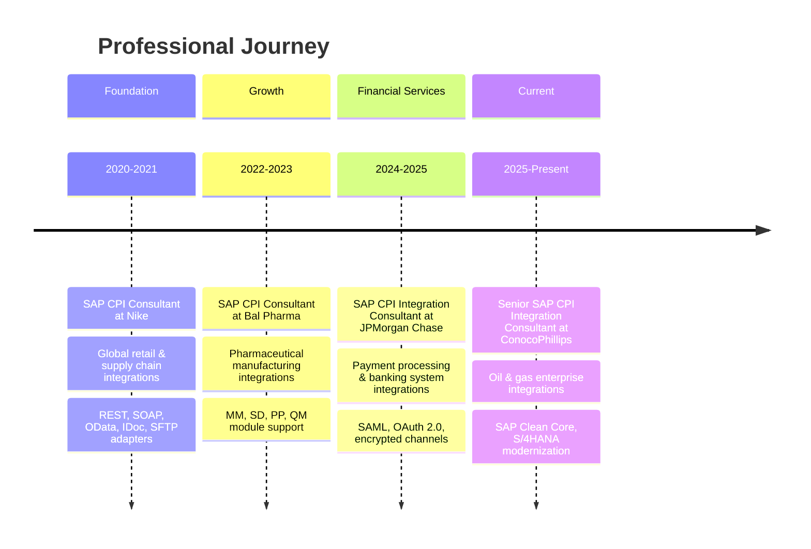
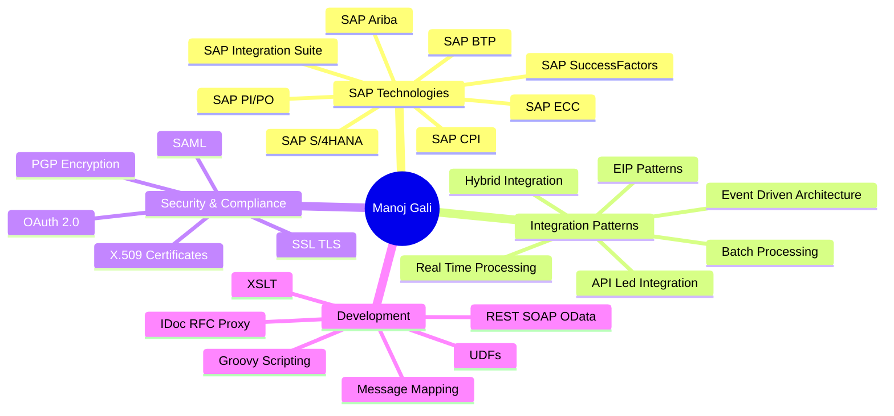

[%20460--1721-25D366?style=for-the-badge&logo=whatsapp&logoColor=white)](tel:+9724601721)

---

## 🎯 SUMMARY

Senior SAP CPI Consultant with 5+ years of experience in SAP integration technologies, specializing in SAP CPI, PI/PO, and hybrid integration landscapes. Experience designing, developing, and optimizing integration solutions across SAP and non-SAP systems at ConocoPhillips, JPMorgan Chase, Nike, and Bal Pharma.

Core areas: SAP CPI iFlow development (Groovy scripting, Message Mapping, Content Modifiers, XSLT), API-led integration with SAP Integration Suite / SAP BTP, and security configuration (OAuth 2.0, X.509 certificates, SSL/TLS, SAML).

### 📊 AT A GLANCE

| | |
|:-----------|:---------------:|
| **Years of Experience** | 5+ |
| **Employers** | ConocoPhillips, JPMorgan Chase, Bal Pharma, Nike |
| **Core Platform** | SAP CPI / SAP Integration Suite / SAP BTP |
| **Education** | MS Information Sciences, Trine University (2023–2025) |

---

## 🏆 CAREER TIMELINE

---

## 💼 EXPERIENCE

### 🏢 ConocoPhillips — Senior SAP CPI Integration Consultant (Sep 2025 – Present)

- Designed and implemented enterprise integrations using SAP CPI to connect SAP S/4HANA, SAP ECC, and external systems across oil & gas business domains.
- Built and optimized iFlows using Groovy scripting, Message Mapping, Content Modifiers, and XSLT for complex data transformations.
- Developed real-time and batch integrations using REST, SOAP, OData, IDoc, and SFTP interfaces.
- Implemented secure integration mechanisms using OAuth 2.0, SSL certificates, Basic Authentication, and SAP Cloud Connector.
- Supported SAP landscape modernization initiatives including SAP S/4HANA migration and legacy interface decommissioning.
- Monitored and troubleshot integration issues using SAP CPI Monitoring, Message Processing Logs, and Exception Subprocesses.
- Collaborated with functional and technical teams to translate business requirements into scalable **SAP BTP** Integration Suite solutions.
- Ensured compliance with SAP Clean Core principles and enterprise security standards.

### 🏦 JPMorgan Chase — SAP CPI Integration Consultant (Oct 2024 – Aug 2025)

- Designed, developed, and deployed SAP CPI integration flows (iFlows) to connect SAP S/4HANA, internal banking systems, third-party APIs, and external partner applications.
- Implemented secure data exchanges using REST, SOAP, OData, IDoc, SFTP, and AS2 protocols to support payment processing, financial reporting, and customer account systems.
- Configured and enhanced integration logic using Groovy scripting, Message Mapping, XSLT, Content Modifier, and Value Mapping components.
- Ensured secure connectivity across on-premise and cloud environments using SAP Cloud Connector, OAuth 2.0, SSL certificates, and SAML.
- Collaborated with functional teams (Finance, Risk, Compliance, Treasury) to translate business requirements into scalable **SAP BTP** Integration Suite solutions.
- Monitored and troubleshot production and pre-production integration issues using SAP CPI Monitoring, Message Processing Logs, and custom alerts.
- Participated in large-scale SAP S/4HANA transformation initiatives, including integration rationalization and consolidation of middleware artifacts.
- Developed reusable integration templates and patterns to standardize integrations across business units such as payments, ledger posting, and data movement.

### 💊 Bal Pharma Limited — SAP CPI Consultant (Jan 2022 – Jun 2023)

- Designed and developed integration solutions using SAP CPI and SAP Integration Suite to support pharmaceutical manufacturing and business processes.
- Implemented cloud and hybrid integrations between SAP ECC, SAP S/4HANA, and non-SAP systems.
- Built and enhanced CPI iFlows using Groovy scripting, Message Mapping, Value Mapping, and adapters such as REST, SOAP, IDoc, RFC, and SFTP.
- Supported integrations across core SAP modules including MM, SD, PP, and QM to enable end-to-end supply chain and production workflows.
- Configured security mechanisms using OAuth 2.0, X.509 certificates, SSL/TLS, and secure credential storage within **SAP BTP**.
- Implemented error handling, message monitoring, and exception management using SAP CPI Monitoring for production support.
- Assisted in interface testing, UAT support, and production deployments.

### 👟 Nike — SAP CPI Consultant (Jun 2020 – Dec 2021)

- Designed and developed enterprise integration solutions using SAP CPI and SAP Integration Suite to support global retail and supply chain operations.
- Implemented cloud and hybrid integrations between SAP ECC, SAP S/4HANA, and multiple non-SAP systems.
- Developed and maintained CPI iFlows using Groovy scripting, Message Mapping, Value Mapping, and adapters such as REST, SOAP, OData, IDoc, and SFTP.
- Built and consumed RESTful APIs and supported API-led integration patterns.
- Configured secure communication using OAuth 2.0, X.509 certificates, SSL/TLS, and secure credential management within **SAP BTP**.
- Performed error handling, message monitoring, logging, and performance tuning using SAP CPI Monitoring.

---

## 🧠 SKILLS MAP

---

## 🛠️ TECHNICAL SKILLS

---

## 🎓 EDUCATION

**Masters in Computer Science** — Trine University, Texas, USA (Jul 2023 – May 2025)

---

📫 Reach me at [manoj.gali695@gmail.com](mailto:manoj.gali695@gmail.com) · [manojgali.com](https://manojgali.com)

