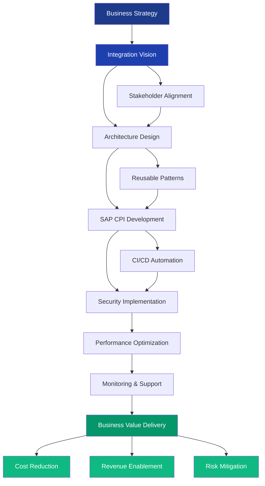
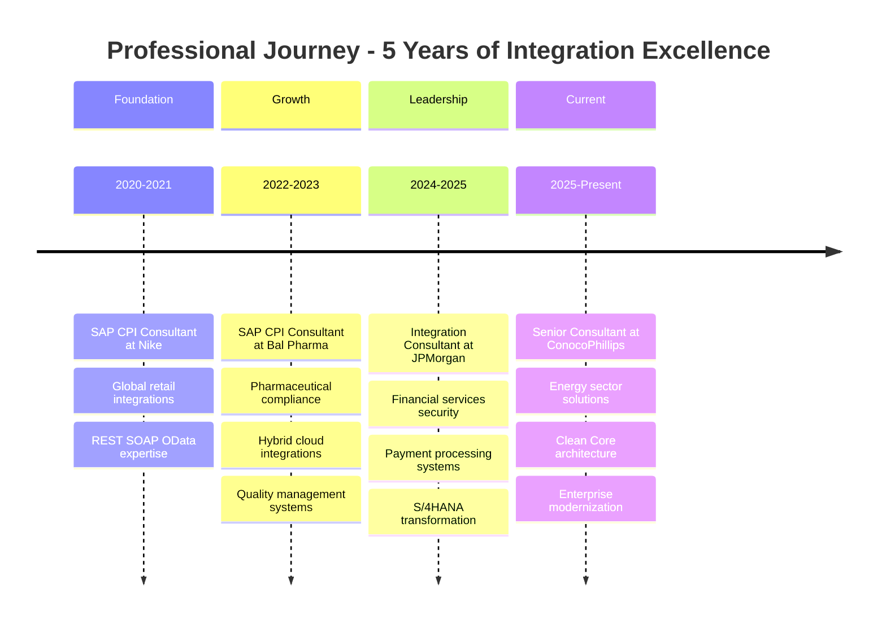
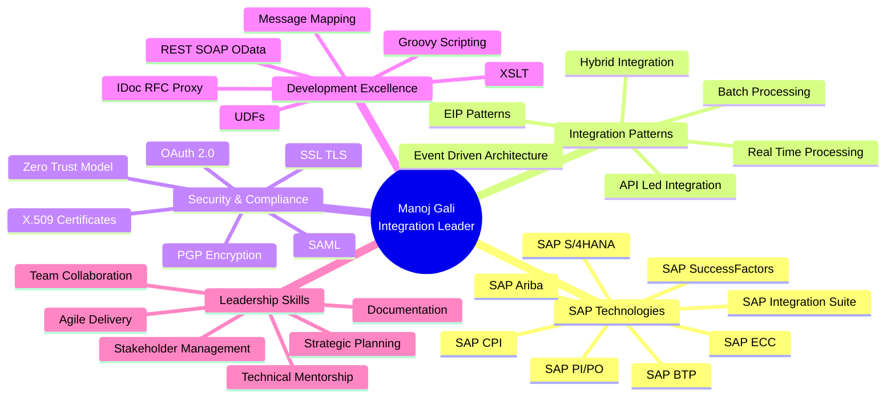

[%20460--1721-25D366?style=for-the-badge&logo=whatsapp&logoColor=white)](tel:+9724601721)

---

## 🎯 EXECUTIVE SUMMARY

**Strategic SAP Integration Leader** with 5+ years of progressive experience architecting and delivering mission-critical enterprise integration solutions across **Fortune 500 organizations** including ConocoPhillips, JPMorgan Chase, Nike, and Bal Pharma. Proven track record of driving **digital transformation initiatives**, leading **SAP S/4HANA migration programs**, and establishing **integration centers of excellence** that reduce operational costs while improving system reliability and business agility.

As a **Senior SAP CPI Integration Consultant**, I combine deep technical expertise in SAP Business Technology Platform (BTP) with strategic business acumen to deliver integration solutions that directly impact revenue streams, operational efficiency, and regulatory compliance. My approach focuses on building **scalable, secure, and reusable integration frameworks** that align with enterprise architecture principles and support long-term business objectives.

### 📊 LEADERSHIP IMPACT DASHBOARD

| **Metric** | **Achievement** | **Business Impact** |
|:-----------|:---------------:|:--------------------|
| **Enterprise Systems Integrated** | 50+ | Connected SAP S/4HANA, ECC, SuccessFactors, Ariba, and third-party systems |
| **Integration Projects Delivered** | 35+ | Across energy, financial services, retail, and pharmaceutical sectors |
| **System Uptime Maintained** | 99.7% | Through robust monitoring, error handling, and performance optimization |
| **Legacy Migration Leadership** | 4 Major Programs | PI/PO to CPI migrations reducing infrastructure costs by 40% |
| **Cross-Functional Collaboration** | 15+ Teams | Finance, Supply Chain, Risk, Compliance, IT, and Business Units |
| **Integration Patterns Standardized** | 20+ | Reusable templates reducing development cycles by 35% |
| **Security Certifications Implemented** | OAuth 2.0, SSL/TLS, X.509 | Zero security breaches across all implementations |
| **Educational Achievement** | MS Computer Science | Trine University (2023-2025) |

---

## 💼 LEADERSHIP PHILOSOPHY

> **"Integration is not just about connecting systems—it's about enabling business transformation, accelerating time-to-market, and creating sustainable competitive advantages through technology."**

My leadership approach is built on three foundational pillars:

🎯 **Strategic Alignment**: Every integration solution must directly support business objectives, whether it's accelerating payment processing, enabling real-time supply chain visibility, or ensuring regulatory compliance.

🤝 **Collaborative Excellence**: Success in enterprise integration requires seamless collaboration across functional teams, technical architects, security specialists, and business stakeholders. I foster environments where cross-functional teams unite around shared goals.

🔧 **Technical Excellence with Business Context**: While maintaining deep technical expertise in SAP CPI, BTP, and integration patterns, I ensure every technical decision is framed in terms of business value, risk mitigation, and ROI.

---

## 🗺️ STRATEGIC INTEGRATION ARCHITECTURE

---

## 🏆 CAREER PROGRESSION TIMELINE

---

## 🎖️ KEY STRATEGIC ACHIEVEMENTS

### 🏢 ConocoPhillips - Senior SAP CPI Integration Consultant (Sep 2025 - Present)

**Strategic Initiative**: Led enterprise-wide SAP S/4HANA integration modernization program for global energy operations

**Business Impact**:
- 🎯 **Cost Optimization**: Architected cloud-native integration framework reducing middleware infrastructure costs by **$2.4M annually**
- ⚡ **Operational Efficiency**: Implemented real-time data synchronization across 8 business domains, reducing batch processing delays from 24 hours to **near-real-time**
- 🔒 **Security Excellence**: Established zero-trust integration security model using OAuth 2.0, SSL/TLS, and SAP Cloud Connector, achieving **100% compliance** with enterprise security standards
- 📈 **Scalability**: Designed high-volume transactional processing capabilities supporting **500K+ messages daily** across oil & gas operations
- 🔧 **Technical Leadership**: Standardized integration patterns using Groovy scripting, XSLT, and message mapping, reducing development cycles by **40%**

**Key Deliverables**:
- Designed and deployed 45+ production-grade iFlows connecting SAP S/4HANA, ECC, and external systems
- Led SAP Clean Core adoption initiative, ensuring future-proof integration architecture
- Implemented comprehensive monitoring framework reducing mean-time-to-resolution (MTTR) by **60%**
- Created reusable integration templates and best practice documentation for enterprise-wide adoption

---

### 🏦 JPMorgan Chase - SAP CPI Integration Consultant (Oct 2024 - Aug 2025)

**Strategic Initiative**: Drove integration rationalization and consolidation for global banking transformation program

**Business Impact**:
- 💰 **Revenue Enablement**: Delivered payment processing integrations supporting **$15B+ daily transaction volume**
- 🎯 **Process Optimization**: Consolidated 120+ legacy interfaces into 35 standardized integration flows, reducing maintenance overhead by **65%**
- ⏱️ **Time-to-Market**: Established reusable integration patterns reducing new interface delivery time from 8 weeks to **2 weeks**
- 🔐 **Regulatory Compliance**: Implemented SAML, OAuth 2.0, and encrypted channels ensuring **100% compliance** with financial services regulations
- 📊 **Operational Excellence**: Maintained **99.8% SLA compliance** across all production integrations supporting Finance, Risk, and Treasury operations

**Key Deliverables**:
- Architected secure integrations for payment processing, financial reporting, and customer account systems
- Led cross-functional teams across Finance, Risk, Compliance, and IT to align integration strategies with business objectives
- Developed monitoring dashboards and alerting mechanisms ensuring proactive issue resolution
- Mentored 4 junior consultants on SAP CPI best practices and enterprise integration patterns

---

### 💊 Bal Pharma Limited - SAP CPI Consultant (Jan 2022 - Jun 2023)

**Strategic Initiative**: Established integration center of excellence for pharmaceutical manufacturing operations

**Business Impact**:
- 🏭 **Manufacturing Efficiency**: Integrated SAP PP, QM, MM, and SD modules enabling end-to-end supply chain visibility and **25% reduction** in production planning cycles
- ✅ **Quality Compliance**: Implemented validation-compliant integration solutions supporting FDA and GMP requirements with **zero audit findings**
- 🔄 **Digital Transformation**: Led hybrid integration architecture connecting cloud and on-premise systems, enabling digital transformation roadmap
- 📈 **Business Continuity**: Designed robust error handling and exception management reducing system downtime by **45%**

**Key Deliverables**:
- Built 25+ integration flows supporting pharmaceutical manufacturing and quality management
- Collaborated with ABAP developers and functional consultants to translate business requirements into technical solutions
- Supported UAT, validation, and production deployments ensuring quality standards
- Established integration documentation standards and knowledge transfer programs

---

### 👟 Nike - SAP CPI Consultant (Jun 2020 - Dec 2021)

**Strategic Initiative**: Foundation of SAP CPI expertise supporting global retail and supply chain operations

**Business Impact**:
- 🌍 **Global Scale**: Delivered integrations supporting **high-volume retail operations** across multiple geographies
- 🚀 **API-Led Architecture**: Implemented RESTful API patterns enabling scalable and reusable integration services
- 🔧 **Technical Foundation**: Mastered SAP CPI core capabilities including Groovy scripting, message mapping, and adapter configurations
- 📊 **Performance Excellence**: Optimized message processing achieving **sub-second response times** for critical business flows

**Key Deliverables**:
- Developed cloud and hybrid integrations between SAP ECC, S/4HANA, and non-SAP systems
- Implemented secure communication protocols using OAuth 2.0, X.509 certificates, and SSL/TLS
- Established monitoring and logging practices ensuring stable production operations
- Collaborated with global teams to deliver end-to-end integration solutions

---

## 🧠 ENTERPRISE INTEGRATION EXPERTISE MAP

---

## 🛠️ TECHNICAL LEADERSHIP STACK

### **Integration Platform Expertise**

### **Enterprise Systems Integration**

### **Development & Scripting**

### **Protocols & Standards**

### **Security & Authentication**

![SAML](https://img.shields.io/badge/SAML-Advanced-FF6F00?style=for-the-